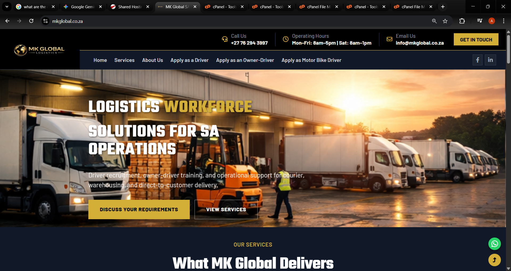
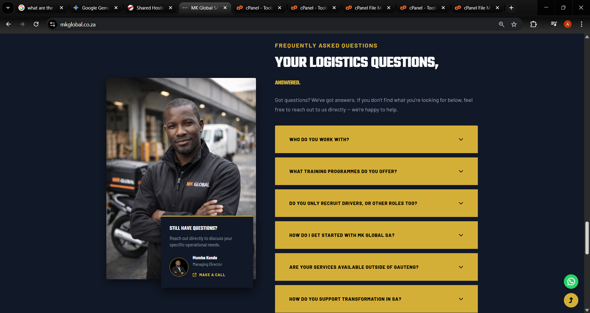
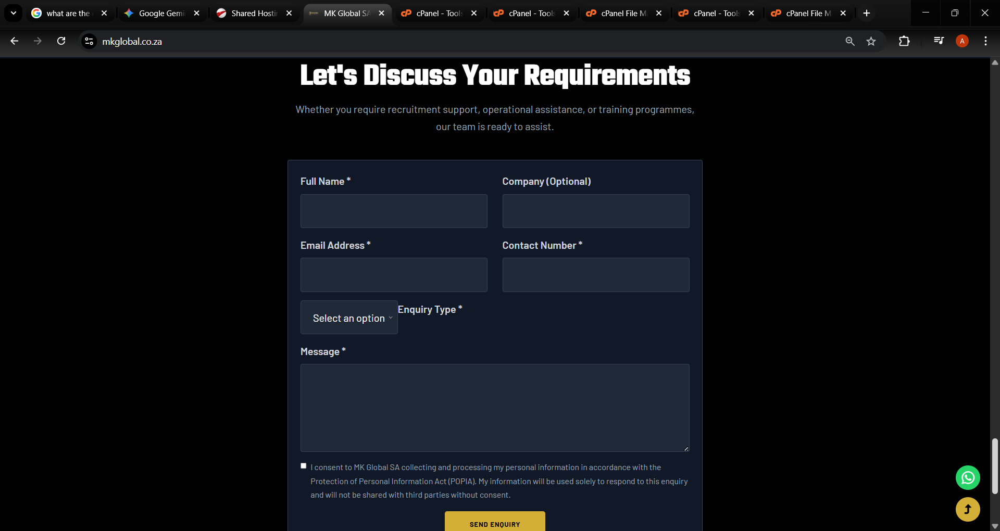

# MK Global Website

This is the official website for **MK Global SA**, a South African company specializing in **logistics, transportation services, and client support solutions**. The website is designed to be **responsive**, ensuring an optimal experience on both desktop and mobile devices. It provides clients with an overview of services, answers to common questions, and an easy way to get in touch.

## Features
- **Home Page:** Highlights MK Global’s services, mission, and company overview.
- **FAQ Page:** Answers frequently asked questions to assist clients quickly.
- **Contact Page:** Includes a contact form integrated with FormSubmit.co for client enquiries and feedback.

## Screenshots

## Author
Angie Ngubane
